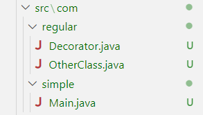
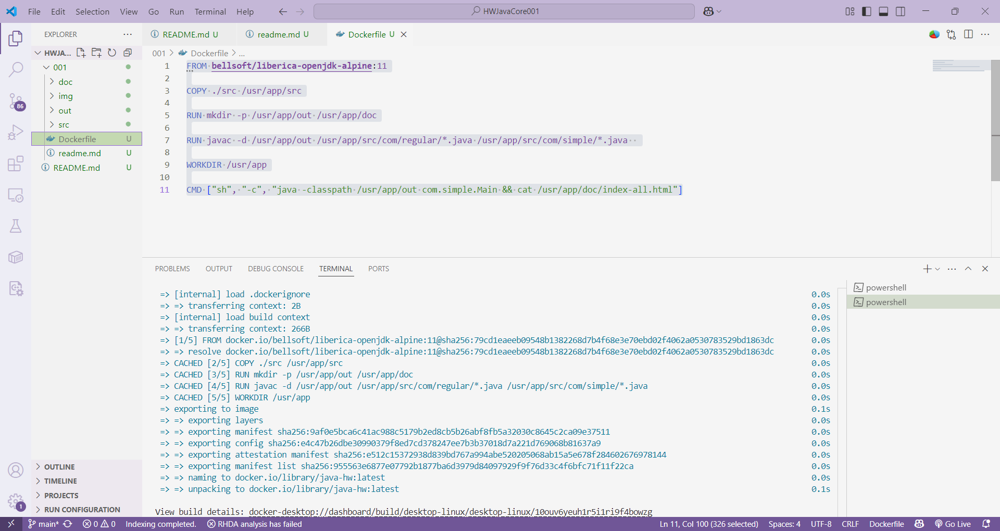
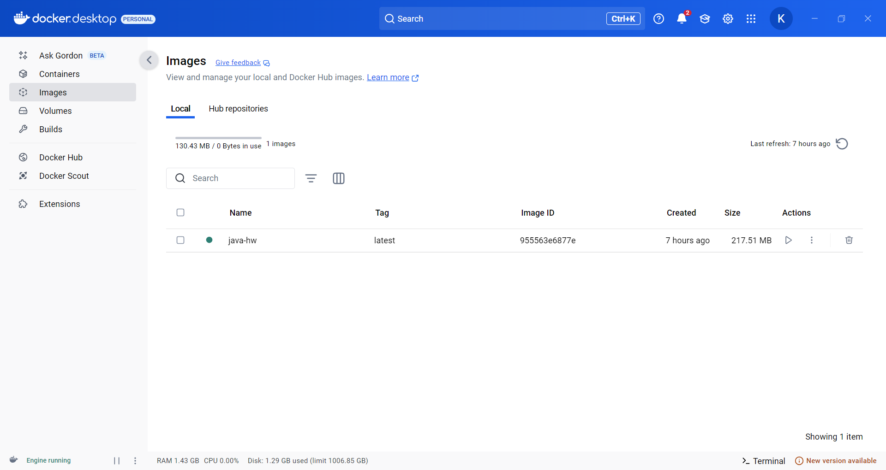
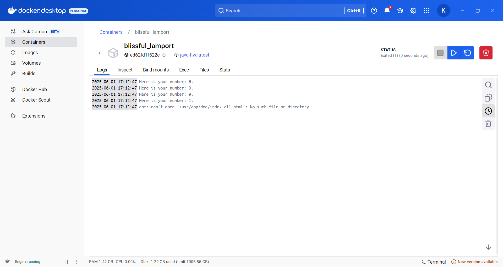

### Homework №1
 * Создать docker-контейнер для формирования полной документации по проекту
 ----
 
 * Структура проекта:

* Dockerfile: 
```
FROM bellsoft/liberica-openjdk-alpine:11

COPY ./src /usr/app/src

RUN mkdir -p /usr/app/out /usr/app/doc

RUN javac -d /usr/app/out /usr/app/src/com/regular/*.java /usr/app/src/com/simple/*.java  

WORKDIR /usr/app

CMD ["sh", "-c", "java -classpath /usr/app/out com.simple.Main && cat /usr/app/doc/index-all.html"]
```



* Собираем контейнер. Выводит:
```
2025-06-01 10:27:18 Here is your number: 6.
2025-06-01 10:27:18 Here is your number: 0.
2025-06-01 10:27:18 Here is your number: 9.
2025-06-01 10:27:18 Here is your number: 1.
```