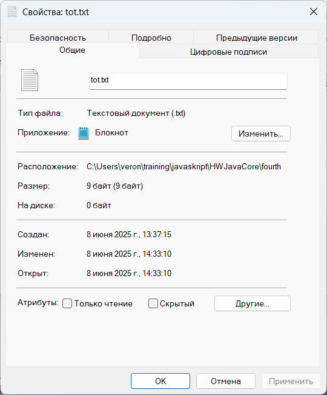
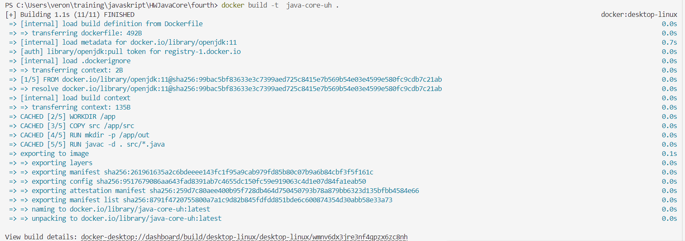
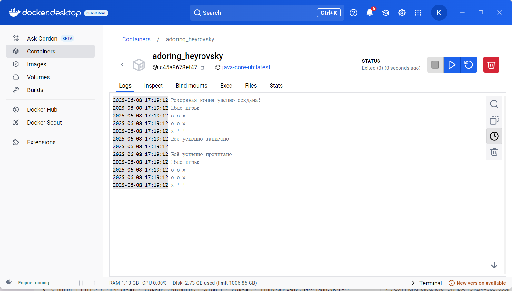

### Промежуточна атестация

_Задания:_

1. Написать функцию, создающую резервную копию всех файлов в директории(без поддиректорий) во вновь созданную папку ./backup
2. Предположить, что числа в исходном массиве из 9 элементов имеют диапазон[0, 3], и представляют собой, например, состояния ячеек поля для игры в крестикинолики, где 0 – это пустое поле, 1 – это поле с крестиком, 2 – это поле с ноликом, 3 – резервное значение. Такое предположение позволит хранить в одном числе типа int всё поле 3х3. Записать в файл 9 значений так, чтобы они заняли три байта. Данная промежуточная аттестация оценивается по системе "зачет" / "не зачет".
"Зачет" - скриншот запущенного и функционирующего приложения dvwa-docker; скриншот успешного цикла CI/CD для проекта dvwa-docker
"Незачет" - нет прикрепленных скриншотов
### Решения:
1. В классе [BackupDir](https://github.com/VeronikaKhodan21/JavaCore/edit/main/fourth/src/BackupDir.java) реализован метод upBackup. Он возвращает Boolean для проверки. Резервная копия сохраняется в папке backup
    Проверяли метод в [файле](https://github.com/VeronikaKhodan21/JavaCore/edit/main/fourth/src/Fourth.java)
2. * Я решила, что состояния ячейки в поле определяется случайным образом
* Класс [PlayGame](https://github.com/VeronikaKhodan21/JavaCore/edit/main/fourth/src/PlayGame.java) содержит все методы по заворачиванию, разворачиванию поля. Файл tot.txt в виде байтов содержит поле


Dockerfile: 
```
# Используем официальный образ OpenJDK
FROM openjdk:11

# Устанавливаем рабочую директорию
WORKDIR /app
# Копируем исходные файлы в контейнер
COPY src /app/src

RUN mkdir -p /app/out
# Компилируем Java файлы
RUN javac -d . src/*.java 
# Указываем команду для запуска приложения
CMD [ "java","Fourth"]
```
* Строим контейнер


* Результат работы контейнера 

